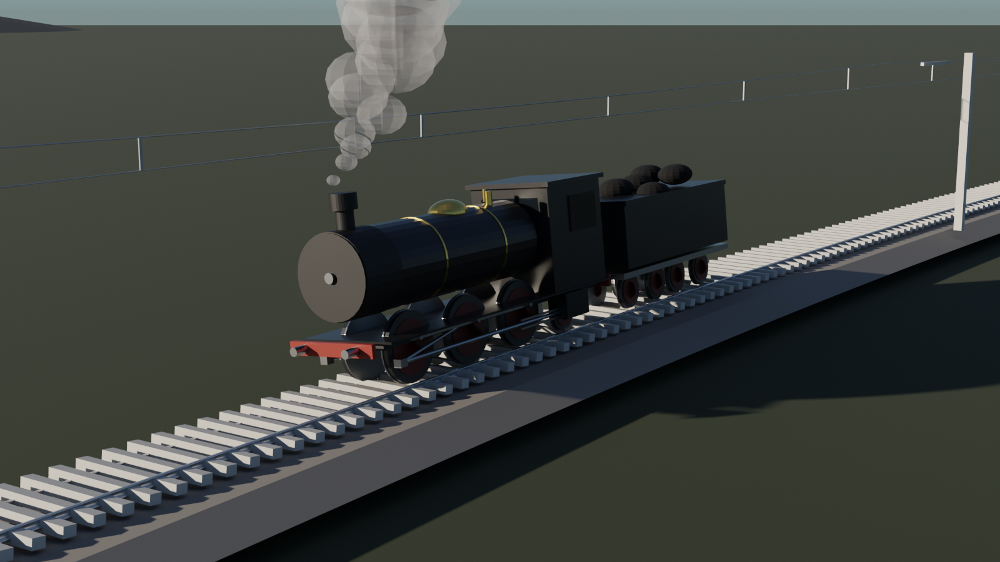
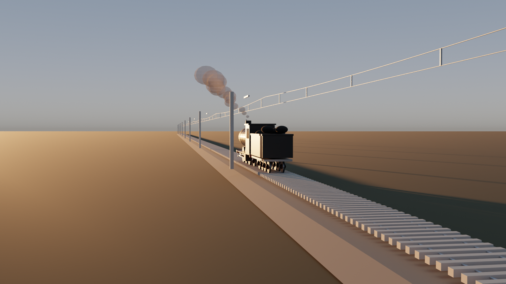
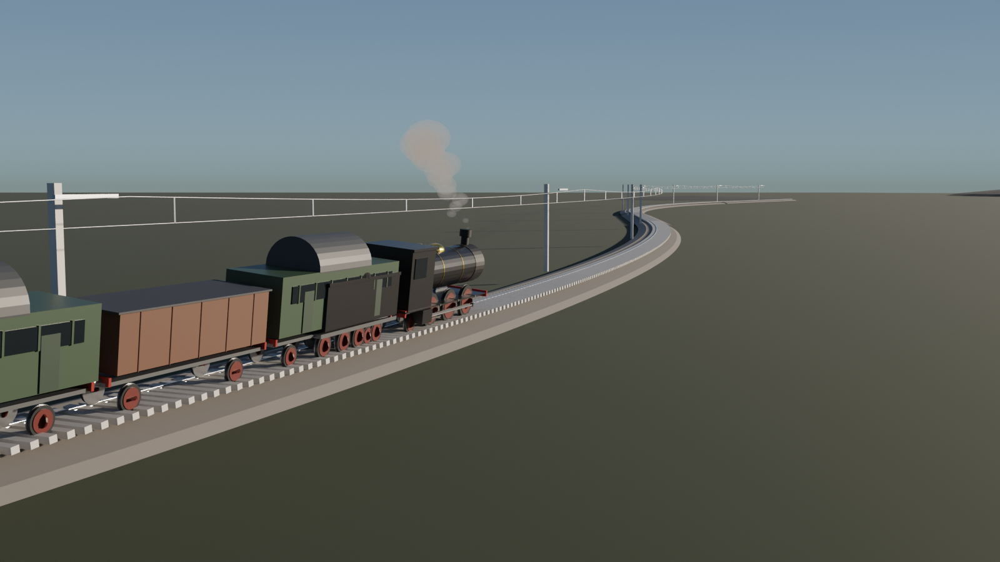
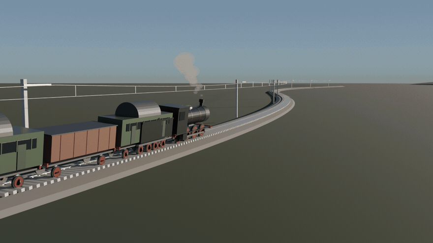
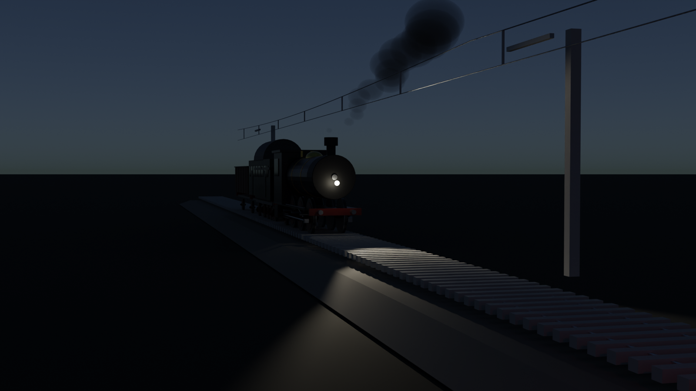
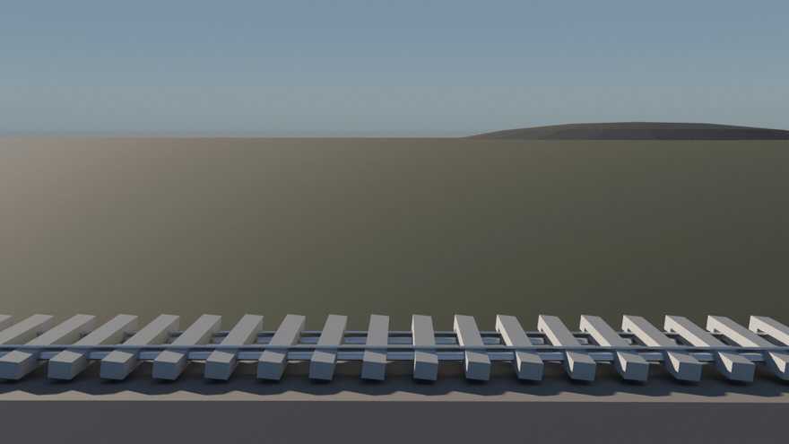

# 🚂🛤️ railway-cinema

**EN:** The **crossover episode**: [`rail-cinema`](https://github.com/efealtiparmakoglu/rail-cinema)'s infinite engineered track + [`train-cinema`](https://github.com/efealtiparmakoglu/train-cinema)'s functional steam locomotive, on one Cycles stage. The locomotive sits on the superelevated curve, its wheels roll **without slip** (θ = s / r), quartered cranks pump the pistons, the chimney breathes world-space smoke, and the camera rides alongside.

**TR:** **Kesişim bölümü**: rail-cinema'nın mühendislikli sonsuz hattı + train-cinema'nın fonksiyonel buharlı lokomotifi, tek Cycles sahnesinde. Lokomotif süpereleyisyonlu viraja oturur, tekerleri **kaysız** yuvarlanır (θ = s / r), çeyreklemli kranklar pistonları besler, baca dünya uzayında tütür ve kamera yanından kovalar.



## 🖼️ Gallery / Galeri

### ⛰️ Geçit — S virajında süpereleyisyonlu sefer

The 2-6-0 leans into the R500 curve with its train, catenary overhead, sleepers marching below. — *2-6-0, vagonu ve kömürüyle R500 virajına yatar; üstte katoneri, altta travers marşları.*

### 🌅 Gün Batımı Ekspresi

Backlit by a 3° sun, the express breathes steam into the golden plain. — *3°'lik güneşle arkadan ışıklanan ekspres, altın ovaya buhar üflüyor.*

### 🚂🚃🚃 Büyük Sefer — 5 araçlı tam tren

Loco + tender + freight + three coaches, each car seated on the path frame at its own arc-length, whole rake leaning into the S-curve. — *Loko + tender + yük + üç yolcu vagonu; her araç kendi yay-uzunluğunda patika çerçevesine oturur, katar S virajına topluca yatar.*


*48 frames: the full rake sweeps through — every axle rolling without slip at its own s.*

### 🌙 Gece Farı

Night run: headlight spot pooling on the sleepers, firebox glow under the cab, red signal down the line, moon-lit sky. — *Gece seferi: traverslere dökülen far konisi, kabin altında ateş kutusu parıltısı, hatta kırmızı sinyal, ay ışıklı gök.*

### 🎬 Geçit geçişi — koşu çekimi

*48 frames: the train sweeps past a fixed camera through the cant — wheels rolling without slip the whole way.*

## 🧱 How it works / Nasıl çalışır

```
rail-cinema/patika.py  →  cerceve(s): konum + teget + sag + cant
        ↓ hat_kur: ray/travers/balast/katoneri geometrisi
train-cinema/tren.py   →  fonksiyonel yurutucu (slider-crank kinematiği)
        ↓ sefer.py birleştirir:
  kok.matrix_world = patika cervecesi (yaw + cant roll gömülü)
  theta = s / TEKER_R          (kaysız yuvarlanma)
  duman dünya uzayında: kaynak = kok.matrix @ baca_lokali
```

## 🚀 Usage / Kullanım

```bash
# kardeş repolar yan yana olmalı
git clone https://github.com/efealtiparmakoglu/rail-cinema
git clone https://github.com/efealtiparmakoglu/train-cinema
git clone https://github.com/efealtiparmakoglu/railway-cinema

blender --background --python sefer.py -- --scene scenes/gecit.json
HIZLI=1 blender --background --python sefer.py -- --scene scenes/gunbatimi_ekspresi.json
blender --background --python sefer.py -- --scene scenes/gecit_gecisi.json --gif 48 --fps 12
```

Sahne JSON'u = rail-cinema formatı + `sefer` bloğu: `s` başlangıç, `hiz`, `vagonlar` (tip/boy listesi → tam katar), `gece` (far/sinyal) + kamera modları: `sabit` / `kacak` (yandan takip) / `kovala` (arkadan kovalama).

## 🧪 Why / Neden

**TR:** İki doğru projenin birleşmesi otomatik değildir: trenin gövdesi patikanın çerçevesine oturmak zorundadır — yaw tegetten, yatış kanttten, teker açısı yoldan gelir. Kaysız yuvarlanma tek satır (θ = s/r) ama treni "kayan maket" olmaktan çıkarıp demiryoluna oturtan şey o satırdır.

## 📄 License

MIT
